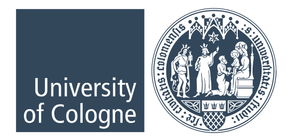

The ABCD-J research community project is a collaboration between specific centres at five research
institutions in the German state of North Rhine-Westphalia: University Clinic
RWTH Aachen, University Clinic Bonn, University Clinic Köln, University Clinic
Düsseldorf and Research Centre Jülich.

## University Clinic RWTH Aachen

## University Clinic Bonn

## University Clinic Cologne

## University Clinic Düsseldorf

## Research Centre Jülich

